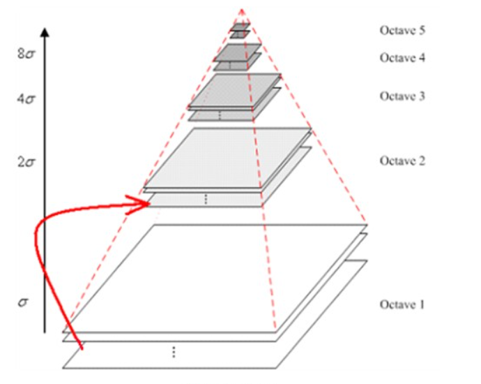
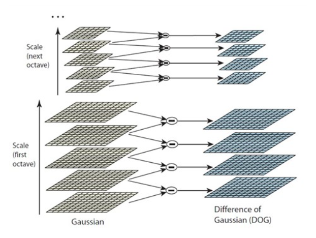
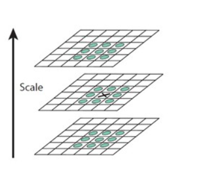
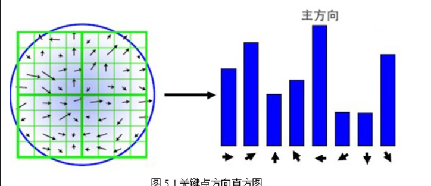
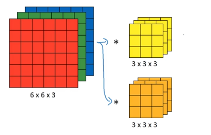
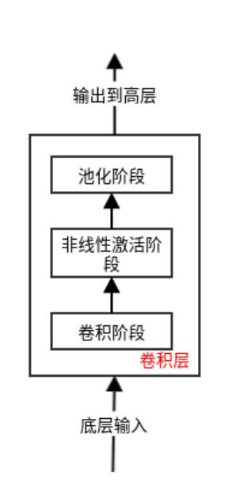
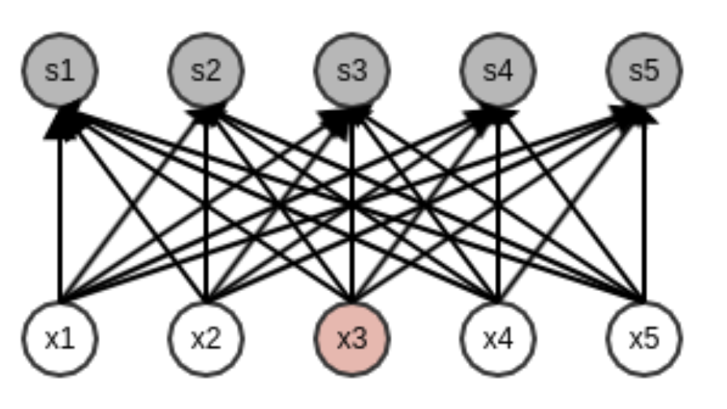

## 8.1 基于内容的媒体检索基本原理

### 引言

媒体信息检索（Multimedia information retrieval)是关于检索多形式、全分布的媒体信息的检索。其分支之一是基于内容的媒体信息检索(Content-based information retrieval)。事实上，如果没有关于相关知识的检索，那么知识能带来的好处也难以体现。在ACM SIGMM会议中曾经提出：“make capturing，storing，finding，and using digital media an everyday occurrence in our computing environment.”(Rowe and Jain 2005)

我们对于数字知识的搜索始于几十年前，媒体数字化的想法逐渐涌入到大众的视野中，但是书籍仍然是存储知识的主要媒介。在多媒体信息检索领域进入到科学界前，已建立的科学领域为其提供了有效的助力，其中包括人工智能、优化理论和计算机视觉等为MIR的数学基础做出了重要贡献；包括美学、人体工程学在内的心理学相关领域，为用户交互提供了基础；图像检索技术例如人脸识别、字符识别等技术的应用也逐渐普遍。

MIR最初的应用基于计算机视觉方面，相关算法注重于对图像、视频和音频进行基于特征的相似性搜索。在90年代中期，相似性搜索的基本概念被应用于互联网图像搜索引擎中，包括Webseek（Smith and Chang 1997）和Webseer（Frankel 1996）。此外，相似性搜索功能也被直接集成到企业级的数据库中（Informix Datablades，IBM DB2 Extenders, Oracle Cartridges），这使得MIR为私营企业所用。

在视频检索领域，90年代中期基于鲁棒性的镜头边缘检测技术是主要关注点，其中最常见的方法是对视频中两个连续帧相对应的颜色直方图之间的距离进行阈值化[ Flickner等， 1995]。 Hanjalic等在1997年提出了一种克服主观阈值问题的方法。该方法不依赖于任何手动参数。哈斯等人在1997年描述了一种使用视频中的运动来确定镜头边界位置的方法。他们的方法优于当时的直方图方法，除此之外，他们还对视频镜头进行了语义分类，例如放大，缩小，平移等。

从21世纪开始，研究人员注意到，基于特征的相似性搜索算法并不像他们期望的那样直观和友好。在2006年2月的ACM Transactions on Multimedia Computing, Communications and Applications会议中提出“systems built by research scientists were essentially systems which could only be used effectively by scientists”，即科学家构建的系统本质上应当是科学家能够有效使用的系统。新的方向是朝着系统设计的方向发展，该系统应该是用户友好的，并且可以将来自图书馆，数据库和馆藏的大量多媒体知识带给世界。需要注意的是，系统的进一步发展将需要理解查询的语义信息，而非仅仅通过底层计算特征信息来辨认。这个普遍的问题被称为“bridging the semantic gap”。从模式识别的角度来看，这意味着将易于计算的基于低级内容的媒体功能转换为对用户而言直观的高级概念或术语。 Rowley等人在1996年展示了结合人类面部概念的语义的例子。ImageScape搜索引擎可能是最早的基于图片内容的检索系统，该系统解决了查询界面，索引编制和结果中的语义鸿沟问题。在该系统中，用户可以使用WWW索引中的空间定位图标（包含10+百万个图像和视频）使用关键帧直接查询多个视觉对象，例如天空，树木，水等。该系统使用信息论来确定最佳特征，以最大程度地减少分类中的不确定性。

需要注意的是，基于特征的相似度搜索引擎在很多情形下都会被运用到。例如搜索商标数据库，为DJ寻找具有相似视觉内容的视频镜头，以寻找具有相似节奏的音乐。而最相关的应用是那些具有诸如图像和视频中的颜色和纹理等基本功能的应用。

### 多媒体检索技术原理与方法

#### 近期工作

多媒体信息检索系统的两个基本必要条件是：（1）搜索特定的媒体项目； （2）浏览和总结媒体收藏信息。在搜索特定媒体项目时，当前系统存在重大局限性，例如无法理解广泛的用户词汇，无法理解用户在ACM Transactions on Multimedia Computing, Communications, and Applications会议中满意度”（2006年2月），也没有可靠的真实代表。世界测试集评估，甚至基准测试都与用户满意度明显相关。总体而言，由于无法弥合计算机与人类之间的语义鸿沟，当前的系统尚未对社会产生重大影响。

#### 常见方法

基于内容的检索技术需要理解媒体对象的内容以及上下文语义环境来进行检索，例如图像中的颜色、纹理、形状，视频中的镜头、场景和镜头的运动，声音中的音调、响度和音色信息等。方法有：

- 相似性检索：采用近似匹配的方式来获得查询结果，从而允许更大的检索误差范围。
- 信息检索：使用检索技术直接对文本、图像、视频和音频进行分析，抽取内容特征，建立索引并检索。
- 多层次检索：结合用户所需的多种信息，包括文本、图像、音频和视频等信息建立多重索引。

### 总结

我们生活在信息时代。显然，我们并不缺乏信息。实际上，我们信息太多了。信息检索（IR）帮助我们过滤信息，以便仅检索具有高度相关性和准确性的信息。 IR的实现方式很多，例如在图书馆和Internet搜索引擎中实现的方式。可用的IR的大多数实现都是基于文本检索的。但是，信息不仅仅限于文本，事实上，每天我们通过感官获得的多媒体信息要比从阅读（文本）获得的信息要多得多。多媒体信息的数量正在迅速增长，如果它们的组织不当，那么我们将无法从拥有的多媒体信息中受益。基于多媒体对象的文本描述（使用基于文本的IR技术）检索多媒体信息需要繁琐的工作来提供文本注释，并提供有关多媒体对象内容的不完整和有偏见的信息。因此，需要一种基于客观内容或基于文本和基于客观内容的多媒体信息检索的组合。当我们从存储在多媒体数据库（可能分布在Internet）中的数百万张图片中进行相似度检索时，不仅能够进行高效，灵活的建模和相似度匹配，还要求高效的整体相似度检索。而基于内容的多媒体信息检索则是一个有趣的研究领域，它允许基于多媒体对象的固有特性进行检索。例如，基于视觉特性（例如图像中对象的颜色，形状或纹理）进行检索，或基于媒体中的对象（图像或视频剪辑）之间的空间关系进行检索。这些技术将为今后的检索效率、检索准确性等提供更多的可能性。

## 8.2 图像特征计算方法

## 图像的颜色特征

### 图像颜色直方图（color histogram）

在图像处理和摄影中，颜色直方图表示图像中颜色的分布。 对于数字图像，颜色直方图表示在固定的颜色范围列表中每个颜色范围内具有颜色的像素数量，这些颜色范围跨越图像的颜色空间，即所有可能颜色的集合。

- calculate: loop through each channel on image and collect **Statistics**

```python
    def count_elements(seq) -> dict:
    ##Tally elements from `seq`
    hist = {}
    for i in seq:
    hist[i] = hist.get(i, 0) + 1
    return hist
```

- example from [WIKIPEDIA](https://en.wikipedia.org/wiki/Color_histogram) 

| origin Image                                                 | histogram                                                    |
| ------------------------------------------------------------ | ------------------------------------------------------------ |
|  | in this histogram different `color` histogram corresponds to different `channel` histogram |

- Drawbacks and other approaches

  **The main drawback** 是表示形式取决于所研究对象的颜色，而忽略了其形状和纹理。 对于对象内容不同，碰巧共享颜色信息的两个图像，颜色直方图可能是相同的

- **Another approach** 是二维彩色直方图。 二维颜色直方图考虑了像素对颜色之间的关系。二维颜色直方图是二维数组。 每个维度的大小是在色彩量化阶段使用的色彩数量。 这些数组被视为矩阵

> Approach about 2D color histogram [openCV](https://docs.opencv.org/master/dd/d0d/tutorial_py_2d_histogram.html)

```python
import numpy as np
import cv2 as cv
from matplotlib import pyplot as plt
img = cv.imread('home.jpg')
hsv = cv.cvtColor(img,cv.COLOR_BGR2HSV)
hist = cv.calcHist( [hsv], [0, 1], None, [180, 256], [0, 180, 0, 256] )
plt.imshow(hist,interpolation = 'nearest')
plt.show()
```


### 图像的颜色矩（color moments）

颜色矩在对抗缩放和旋转时具有较好的鲁棒性. 通常情况是，在图像检索应用程序中，只有前三个颜色矩用作特征，因为大多数颜色分布信息都包含在低阶矩中。由于色矩同时对形状和颜色信息进行编码，因此在变化的光照条件下使用它们是一个很好的功能，但是它们无法非常成功地处理遮挡 [WIKIPEDIA](https://en.wikipedia.org/wiki/Color_moments)

- Mean

  第一个色阶可以解释为图像中的平均色

$$
E_i = \sum_{j=1}^{N}\frac{1}{N}P_{ij}
$$

​		其中，N是图像中的像素总数并且 $p_{ij}$ 是图像第 i 通道的的第 j 个像素

- Standard Deviation

  第二个色矩是标准差，它是通过取颜色分布方差的平方根获得的
$$
\sigma_i = \sqrt[2]{(\frac{1}{N}\sum_{j=1}^N(p_{ij}-E_i)^2)}
$$

   其中 $E_{i}$ 是图像第 i 个颜色通道的平均值或第一个色矩 

- Skewness

  它可以测量颜色分布的不对称性，从而提供有关颜色分布形状的信息
  $$
  s_i = \sqrt[3]{(\frac{1}{N}\sum_{j=1}^N(p_{ij}-E_i)^3)}
  $$
  
  > **Applications** 
  > 色彩矩在图像检索中具有重要的应用。 可以使用它们来比较两个图像的相似程度。 这是一种相对较新的颜色索引方法。 使用色彩矩的最大优势在于无需存储完整的色彩分布。 由于要比较的功能较少，因此可以大大加快图像检索速度

### 图像的纹理特征(Image texture features)

图像纹理是在图像处理中计算出的一组度量，旨在量化图像的感知纹理。 图像纹理为我们提供了有关图像或图像选定区域中颜色或强度的空间排列的信息。 可以人工创建图像纹理或在图像捕获的自然场景中找到图像纹理。 图像纹理是可用于帮助图像分割或分类的一种方法。 对于更精确的分割，最有用的功能是空间频率和平均灰度。 [WIKIPEDIA](https://en.wikipedia.org/wiki/Image_texture)

#### Relative Algorithm

##### Tamura texture features

基于心理学对人类视觉纹理认知研究结果的一组纹理特征表示 [Six Dimension](https://www.cs.auckland.ac.nz/compsci708s1c/lectures/Glect-html/topic4c708FSC.htm#tamura)          

- coarseness(粗糙度)

  1. 目标: 存在粗糙纹理时，最好选择大尺寸，或者只有细纹理时，选择小尺寸

  2. Step: 在每个点计算不同规模的平均值

     > At each pixel (x,y), compute six averages for the windows of size 2^k × 2^k, k=0,1,...,5, around the pixel.

     $$
     A_k(x,y) = \sum_{i=x-2^{k-1}}^{x+2^{k-1}-1}\sum_{j=y-2^{k-1}}^{y+2^{k-1}-1}\frac{I(i,j)}{2^{2k}}
     $$

  3. Step: 计算不同方向上相对比例的每个比例上的邻域差异
  
     > At each pixel, compute absolute differences E_k(x,y) between the pairs of no overlapping averages in the horizontal and vertical directions
  
     $$
     E_{k,h}(x,y) = |A_k(x-2^{k-1},y)-A_k(x+2^{k-1},y)|
     $$
  
  4. Step: 选择变化最大的比例
     $$
     S_{max}(x,y)=2^k, s.t. E_k=max({E_1,E_2,...,E_L})
     $$
     
  5. Step: 计算粗糙度
     $$
     M_{crs} = \frac{1}{n\times m}\sum_{i}^{n}\sum_{j}^mS_{max}(i,j)
     $$
  
- directionality(方向度)

  使用定向局部边缘相对于其定向角的频率分布来测量定向度。 边缘强度e（x，y）和方向角a（x，y）使用Sobel边缘检测器计算得出，近似图像的像素方向x和y导数
  $$
  \theta = \tan^{-1}(\frac{\nabla_v}{\nabla_H})+\frac{\pi}{2}| \\
  \nabla G| = \frac{|\nabla_v|+|\nabla_H|}{2} s.t.\nabla_v\left[ \begin{matrix}
              -1&0&1\\
              -1&0&1\\
              -1&0&1\\
              \end{matrix} \right]
              \nabla_H\left[ \begin{matrix}
              1&1&1\\
              0&0&0\\
              -1&-1&-1\\
              \end{matrix} \right]
  $$
  
- line likeness(线相似度)

  线相似度特征 $F_{lin}$ 定义为在每个像素中沿边缘方向以距离d隔开的像素对中同时出现的边缘方向（更准确地说是编码方向角）的平均重合。 预期边缘强度将大于给定的阈值，从而消除了琐碎的“弱”边缘。 通过角度之间的余弦余弦来测量重合，因此在同一方向上的同现以+1进行计算，在垂直方向上的同现以-1进行计算。  

- regularity(规整度)

  规整度特征定义为 $F_{reg}$ ，其中r是归一化因子，每个s ...表示纹理被划分为每个子图像中相应特征 $F_...$ 的标准偏差
  $$
  F_{reg}=1-r(s_{crs}+s_{con}+s_{dir}+ s_{lin})
  $$

- roughness(粗略度)  

  > given by simply summing the coarseness and contrast measures

  $$
  F_{rgh} = F_{crs}+F_{con}
  $$

- **Self-regression texture model**

  自回归纹理模型（simultaneous auto-regressive, 或SAR）是MRF模型的一种应用实例。像素灰度级从它们的邻域中的灰度级来估计 , 其中使用了线性估计参数 ,参数的估计采用 最小均方误差准则或最大似然估计方法 。模型的参数在细微纹理中变化显著 , 但是对于粗糙纹理则基本不变 。
  $$
  g(s) = \mu + \sum_D\theta(r)\cdot g(s+r)+ \varepsilon_0(s)
  $$
  其中μ 是基准偏差，由整幅图像的平均强度值所决定，D表示了s的相邻像素集。θ (r) 是一系列模型参数，用来表示不同相邻位置上的像素的权值。ε (s) 是均值为0而方差为`$\sigma^2$` 的高斯随机变量。通过上式可以用回归法计算参数 θ 和标准方差 $\sigma$ 的值

  

- **边缘直方图**  

  利用卷积运算捕捉图像子图像块的边缘，并进行直方图统计和均衡化提取图像特征: 0deg 45deg 90deg  135deg none

- filters

  
  


- **离散傅里叶变换**

  通过将图像变换到频域来提取纹理特征
  $$
  f(a,b) = \frac{1}{N^2}\sum_{k=0}^{N-1}\sum_{l=0}^{N-1}F(k,l) \cdot e^{2j\pi(\frac{ka}{N}+\frac{lb}{N})}
  $$
  

- **[Gabor Texture](https://en.wikipedia.org/wiki/Gabor_filter)**
- **[小波变换提取图像特征](https://www.researchgate.net/publication/4319558_Feature_Extraction_Technique_using_Discrete_Wavelet_Transform_for_Image_Classification)**
- Discussions
  - 主要优点
    1. 旋转不变性
    2. 对噪声具有一定的抗性
  - 缺点
    1. 图像分辨率的改变会对最终的计算结果产生一定的偏差
    2. 可能会受到照度或反射的影响
    3. 2D反射的纹理可能与3D有所不同


### 图像的形状特征（image shape features）

形状特征是根据对象段或区域进行计算的，主要包括轮廓特征和区域特征

#### 基于区域（Region-based Descriptor）

1. 区域面积
2. 偏心率
3. 几何矩
4. 通用傅里叶描述子
5. 栅格法
6. 中轴
7. 形状描述矩

#### 基于轮廓（Contour-based Descriptor）

1. 链码：链码是通过一个给定的方向上的单位尺寸的直线片段的序列来描述一条曲线或一个二维形状的边界。根据连通定义的不同可分为4方向链码（0到3）和8方向链码（0到8）

   

2. 多边形近似：多边形逼近方法的基本思想是通过与对象区域近似的多边形的顶点来表示该区域。这个近似的多边形则是由顶点连接顶点的直线段序列组成。如果多边形的线段数与边界上的点数相等，即每对相邻点定义多边形的一个边，则多边形可以完全准确的表达边界

3. 傅里叶描述子：傅立叶描述子是物体形状边界的傅立叶变换系数，它是物体边界信号频域分析的结果。假设一个物体的轮廓是由一系列坐标的像素组成，通过边界点的坐标可以获得形状的复坐标函数、曲率函数以及质心距离三种表达方式

4. 小波变换：小波变换在时域和频域上有突出信号局部特征和进行多分辨率分析的能力，因此被广泛应用于形状描述中。小波描述符定量描述边界的基础是将边界坐标看作一个复数序列，并对该复数序列做小波变换。

5. 尺度空间：曲率尺度空间描述符是将经典CSS(Curvature scale space，曲率尺度空间)算法应用到形状描述符中，由F.Mokhtarian和Mackworth首先提出。其具体方法是沿着形状的轮廓，用不同带宽的Gaussian核来平滑轮廓，然后计算采样点的曲率并找出曲率过零点。重复上述平滑过程直到找不到曲率过零点，最后根据高斯函数标准差及其对应的曲率过零点建立一个CSS二值图像作为描述该形状的特征

6. 边界长度


### 局部特征

#### SIFT 算法

SIFT 算法全称是尺度特征不变匹配算法 (Scale Invariance Feature Transform). SIFT 特征是基于物体上的一些局部外观的兴趣点而与影像的大小和旋转无关。对于光线、噪声、些微视角改变的容忍度也相当高。基于这些特性，它们是高度显著而且相对容易撷取，在母数庞大的特征数据库中，很容易辨识物体而且鲜有误认。使用 SIFT特征描述对于部分物体遮蔽的侦测率也相当高，甚至只需要3个以上的SIFT物体特征就足以计算出位置与方位。在现今的电脑硬件速度下和小型的特征数据库条件下，辨识速度可接近即时运算。SIFT特征的信息量大，适合在海量数据库中快速准确匹配。 [^csdn:sift] 

SIFT算法的特点有

1. SIFT特征是图像的局部特征，其对旋转、尺度缩放、亮度变化保持不变性，对视角变化、仿射变换、噪声也保持一定程度的稳定性
2. 独特性（Distinctiveness）好，信息量丰富，适用于在海量特征数据库中进行快速、准确的匹配
3. 多量性，即使少数的几个物体也可以产生大量的SIFT特征向量
4. 高速性，经优化的SIFT匹配算法甚至可以达到实时的要求
5. 可扩展性，可以很方便的与其他形式的特征向量进行联合

[^csdn:sift]: https://blog.csdn.net/zddblog/article/details/7521424


SIFT 算法大致能分解为如下四个步骤

1. 尺度空间极值检测：搜索所有尺度上的图像位置。通过高斯微分函数来识别潜在的对于尺度和旋转不变的兴趣点。
2. 关键点定位：在每个候选的位置上，通过一个拟合精细的模型来确定位置和尺度。关键点的选择依据于它们的稳定程度。
3. 方向确定：基于图像局部的梯度方向，分配给每个关键点位置一个或多个方向。所有后面的对图像数据的操作都相对于关键点的方向、尺度和位置进行变换，从而提供对于这些变换的不变性。
4. 关键点描述：在每个关键点周围的邻域内，在选定的尺度上测量图像局部的梯度。这些梯度被变换成一种表示，这种表示允许比较大的局部形状的变形和光照变化。

##### 极值检测

首先是高斯滤波，我们用二维的高斯函数
$$
G(x, y) = \frac1{2\pi\sigma^2}e^{-\frac{(x-m/2)^2 + (y-n/2)^2}{2\sigma^2}}
$$
选择合适的滤波核大小之后对图片进行卷积。为了提高卷积效率，其实一次二维矩阵变化可以通过竖直方向和水平方向的高斯矩阵变换得到，这个手法叫做分离高斯核卷积。

接下来是尺度空间，尺度空间各尺度的图片的模糊程度逐渐变大，能够模拟人在距离目标由近到远的形成过程。一个图像的尺度空间 $L(x, y, \sigma)$ 可以定义为一个变化尺度的高斯函数核原图像的卷积:
$$
L(x, y, \sigma) = G(x, y, \sigma) * I(x, y)
$$
我们需要对图片不断降采样之后堆叠起来获得一个金字塔



金字塔层数由如下公式控制:
$$
n = log_2(M, N) - t, t\in [0, log_2{min(M, N)}].
$$
2002 年Mikolajczyk在详细的实验比较中发现尺度归一化的高斯拉普拉斯函数 $\sigma^2\nabla^2G$ 的极大值核极小值以及它的特征提取函数 (harris 角，梯度等) 能产生最稳定的图像特征，而 高斯差分函数 (Difference of Gaussian, DOG) 和尺度归一化函数非常相似 
$$
\sigma\nabla^2G = \frac{\partial G}{\partial \sigma} \approx \frac{G(x, y, k\sigma)-G(x, y, \sigma)}{l\sigma-\sigma} \\
so\ we\ have: \\
G(x, y, k\sigma) - G(x, y, \sigma) \approx (k-1)\sigma^2\nabla^2G
$$
所以我们能通过金字塔每一组上下两张图片相减获得差分金字塔



极值点可以在DOG 空间里面找到，每一个像素和相邻几个比较是否是最大或者最小的，包括不同尺度域里进行比较:



###### TL;DR

大致思想是把按照缩放分组，每一组内用不同的高斯卷积核卷积，最后在计算组内差分，寻找极值

假设 $k$ 是每一层的倒数:
$$
k = 2 ^{1/S}
$$
那么尺度坐标是
$$
\sigma(s) = \sqrt{(k^S\sigma_0)^2 - (k^{s-1}\sigma_0)^2}
$$
我们有公式:
$$
D(x, y, \sigma) = [G(x, y, \sigma(s+1)) - G(x, y, \sigma(s))]*I(x, y)  \\
= L(x, y, \sigma(s+1)) - L(x, y, \sigma(s))
$$


##### 关键点定位

关键点定位从离散空间的点中找到连续空间的极值点，这就需要插值函数的存在, 我们可以用如下 泰勒展开进行拟合:
$$
D(X) = D + \frac{\partial D^T}{\partial X} X + \frac12 X^T\frac{\partial D}{\partial X^2} X, where\\
X = (x, y , \sigma)^T
$$
求导使得方程为 0， 就可以得到极值点的偏移量:
$$
\hat{X} = - \frac{\partial^2D^{-1}}{\partial X^2} \frac{\partial D}{\partial X}.
$$
对应极值点的时候方程的值是:
$$
D(\hat X) = D + \frac12\frac{\partial D^T}{\partial X} \hat X
$$
其中 $\hat X = (x, y , \sigma)^T$ 代表了相对插值中心的哦i按一辆，当它在任意维度上的偏移量大于 0.5 的时候，说明插值中心已经偏移到临近的点上去了，必须改变当前关键点的位置，同时在新的位置上反复插值直到收敛为止。如果多次迭代的时候发现超过迭代最高次数或者是超出了图片的边界范围的时候，这样的点应该被删除。

DOG 算子会产生较强的边缘响应，需要剔除不稳定的边缘响应点，获取特征点处的Hessian矩阵，主曲率可以用一个 2x2 的Hesssian 矩阵 H 求出
$$
H = \left[ \begin{matrix} 
D_{xx} & D_{xy} \\
D_{xy} & D_{yy}
\end{matrix} \right]
$$
H 的特征值 $\alpha$ 和 $\beta$ 代表x和y方向的梯度:
$$
Tr(H) = D_{xx} + D_{yy} = \alpha + \beta\\
Det(H) = D_{xx} D{yy} - (D_{xy})^2 = \alpha\beta
$$
如果 $\alpha$ 是一个较大的特征值，而 $\beta$ 是一个较小的，令 $\alpha = r\beta$, 那么:
$$
\frac{Tr(H)^2}{Det(H)} = \frac{(\alpha+\beta)^2}{\alpha\beta} = \frac{r\beta+\beta}{r\beta^2} = \frac{(r+1)^2}{r}.
$$
接下来我们需要筛选关键点: 如果 $\alpha$ 和 $\beta$ 是分别是最大最小的特征值，那么 我们有:
$$
\frac{Tr(H)^2}{Det(H)} \lt \frac{(r+1)^2}{r}.
$$
成立的时候我们保留这个关键点。


##### 找到方向

为了让描述符有旋转不变性，需要用图像的局部特征为每一个关键点分配一个基准方向，使用图像梯度的方法去局部结构为稳定的方向。在关键点上采集高斯金字塔图像 $3\sigma$ 领域窗口内像素的梯度和方向分布特征:
$$
m(x, y) = \sqrt{((L(x+1, y) - L(x-1, y))^2 + ((L(x, y+1) - L(x, y-1))^2} \\
\theta(x, y) = tan^{-1} \frac{L(x, y+1) - L(x, y-1)^2}{L(x+1, y) - L(x-1, y)} 
$$
完成梯度经计算之后，用直方图统计领域的梯度和方向



以直方图最大值作为该关键点的主要方向，为了增强撇配的鲁棒性。


##### 关键点特征描述

通过以上步骤，每一个关键点都有三个信息: 位置、尺度以及方向。接下来为每一个关键点建立描述符，用一组向量把这个关键点描述出来。在关键点尺度窗口 4x4 计算 8 个方向的梯度信息:

1. 确定计算描述子所需的图像区域

$$
radius = \frac{3\sigma_{oct} \times \sqrt 2\times (d+1)}2
$$

2. 将坐标轴旋转为关键点的方向，以确保旋转不变性

$$
\left( \begin{matrix}
x' \\ y'
\end{matrix}\right) = \left(\begin{matrix} 
\cos\theta & -\sin\theta \\
\sin \theta & \cos\theta
\end{matrix}\right)
\left( \begin{matrix}
x \\ y
\end{matrix}\right)
$$

3. 将邻域内的采样点分配到对应的子区域内，将子区域内的梯度值分配到8个方向上，计算其权值

$$
\left( \begin{matrix}
x'' \\ y''
\end{matrix}\right) = \frac1{3\sigma} 
\left( \begin{matrix}
x' \\ y'
\end{matrix}\right)
+ \frac d2
$$

​		然后梯度大小用高斯加权计算:
$$
w = m(a+x,b+y)*e^{=\frac{(x')^2 + (y')^2}{2\times (0.6d)^2}}
$$

4. 插值计算每个种子点八个方向的梯度

$$
weight = w*dr^l*(1-dr)^{1-k}*dc^m*(1-dc)^{1-m} * d o ^n * (1-do)^{1-n}.
$$

5. 上述统计的就是特征向量，为了除去光照变化影响，需要归一化处理，对图像灰度值整体飘逸L

$$
l_i  = h_i / \sqrt{\sum_{j=1}^{128}h_j}
$$

6. 描述子向量门限。非线性光照，相机饱和度变化对造成某些方向的梯度值过大，而对方向的影响微弱。因此设置门限值(向量归一化后，一般取0.2)截断较大的梯度值。然后，再进行一次归一化处理，提高特征的鉴别性。
7.  按特征点的尺度对特征描述向量进行排序。


### 全局特征

#### CNN

  

现在比较流行的提取特征的方法是使用卷积神经网络。

与传统算法最大的不同是，通过机器学习的算法不需要人们手动指定每一步的参数（如下面卷积层中每一个卷积核的权重），而在深度学习中，甚至不需要指定网络去学习的具体特征，都靠网络自己去学习。（如可以跳过人脸检测，直接完成人脸属性识别的任务）

卷积神经网络通常可以分成多个层，每一层可以把一张多维的矩阵和多维的矩阵卷积:





所以一层网络可以使用如下表示：
$$
y_c^{[l]} = W^{[l]} x^{[l-1]} + b^{[l]}\\
y_a^{[l]} = activate(y_c^{[l]})\\
x^{[l]} = pooling(y_a^{[l]})
$$
其中 $W^{[l]}, b^{[l]} $是神经网络第 L 层需要训练的参数, $activate(\cdot)$ 是激活函数，$pooling(\cdot)$是池化函数，$x^{[l]}$ 是这一层的输出，而 $x^{[0]}$ 是原始图像。

这样的一层网络，我们可以将它分割成三个阶段：

- 第一阶段子层：执行卷积运算。

  这个阶段是线性变换，其作用是从输入中提取特征。

  卷积核的大小，也叫感受野，决定了特征提取的基本单位。

  在卷积操作中，我们可以通过调整卷积核的大小，提取不同的特征。

  每一个卷积核就代表输出一个通道，通过增加卷积核的个数就可以增加提取特征的通道数。

- 第二阶段子层：执行非线性的激活函数（如`reLU`单元）。

  这个阶段是非线性变换，其作用是引入非线性。

  如`relu`操作：
  $$
  relu(x) =
          \begin{cases}
          x,  & \text{if $x$ >= 0} \\
          0, & \text{if $x$ < 0}
          \end{cases}
  $$
  实际应用中，这一阶段可以被丢弃，因为第三阶段也可以引入非线性。

- 第三阶段子层：通过池化函数来调整输出。

  池化操作，一般分为两种，最大池化和平均池化。

  每个池化操作也有自己的一个窗口，如2x2或3x3。

  在池化窗口中选择最大值来代替该区域的特征，称作最大池化。

  选择池化窗口中所有值的均值来代替该区域的特征，则称作平均池化。

  这个阶段也是非线性变换，其作用是降低输出的维度（如图像的长宽），完成下采样，但保留了大部分重要的信息。

每一个卷积层提取的特征不同，一开始的卷积层，可能只能提取线条特征，但随着网络的深入，可以提取角、轮廓、形体特征，可以根据自己的需求调整网络结构。

最后，我们接一层全连接层（全连接层指将这一层的所有输入与所有输出之间建立组合关系），来得到我们最后想要的输出（如我们的任务是鉴别10类互不兼容的物体，那么这一层就会输出十个值，代表结果是每一类的可能性）



之所以引入卷积层而不是每一层都是全连接层，是为了减少网络连接之间的参数数量，同时保留了图像的主要特征。

基于CNN，人们设计了VGG、Inception、Resnet等神经网络结构，识别率在近几年的图像识别大赛上不断突破。

## 8.3 图像相似度计算方法

图像相似度计算通常分为两个部分： 

1. 提取图像特征 (通常是固定长度的向量)
2. 计算两个向量的相似度

有如下方法来计算向量的相似度

### 欧几里得距离

如果 $\vec{p}=(p_1,p_2, ..., p_n)$ 和 $\vec{q}=(q_1,q_2, ..., q_n)$ 是啷个欧式空间的 n 维向量，他们的欧式距离可以用以下公式计算
$$
d(\vec{p}, \vec{q}) = \sqrt{\sum_{i=1}^n(q_i-p_i)^2}
$$
欧式距离的优点在于: 即便是整个欧式空间坐标变换之后，它还能保持相对大小的一致性。[^euc]

事实上我们希望如果两个图片相似度越大，其差异值计算出来越小，所以我们有如下公式:
$$
diff(\vec{p}, \vec{q}) = e^{-d(\vec{p}, \vec{q})} = e^{-\sqrt{\sum_{i=1}^n(q_i-p_i)^2}}
$$
在使用指数函数的优点是能放大当 $d(\vec{p}, \vec{q})$ 数字比较小的时候的差距。

这个方法的有效性和鲁棒性其实主要取决于要看特征向量。

[^euc]:  Petko Faber and Robert B. Fisher. 2001. Pros and Cons of Euclidean Fitting. In *Proceedings of the 23rd DAGM-Symposium on Pattern Recognition*, Bernd Radig and Stefan Florczyk (Eds.). Springer-Verlag, London, UK, UK, 414-420.  


### 直方图重合度 (HISM)

首先需要一个直方图:


首先我们给出这个算法的公式，假设 $I$ , $M$ 分别是两张图片的直方图，其中我们认为 $M$ 是基准图片(它和其他照片比较找到和它最相似的图片) 那么他们的重合(intersection) 可以定义为:
$$
\sum_{j=1}^n min(I_j, M_j)
$$
从更加直观的角度理解是，有多少个像素点在两张图片上拥有相同的颜色。

为了归一化，我们除以基准照片总的像素点:
$$
similarity(I_j, M_j) = \frac{\sum_{j=1}^n min(I_j,M_j)}{\sum_{j=1}^nM_j}
$$
这个方法对色彩特别敏感。如果需要按照色彩去划分和相似度比较(例如不同风格的照片等)，这个方法非常管用。而且这个方法不需要区分前后景，即便是前景的物体被这笔了一部分，它还是有较高的鲁棒性。 [^hism]

[^hism]: https://mpatacchiola.github.io/blog/2016/11/12/the-simplest-classifier-histogram-intersection.html


### 马氏距离

 马氏距离(Mahalanobis distance)是由印度统计学家马哈拉诺比斯(P. C. Mahalanobis)提出的，表示点与一个分布之间的距离。它是一种有效的计算两个未知样本集的相似度的方法。与欧氏距离不同的是，它考虑到各种特性之间的联系（例如：一条关于身高的信息会带来一条关于体重的信息，因为两者是有关联的），并且是尺度无关的(scale-invariant)，即独立于测量尺度。对于一个均值w为 $\mu$, 协方差为 $\Sigma$ 的多变量向量其马氏距离为: [^bk_ma]

[^bk_ma]: https://baike.baidu.com/item/%E9%A9%AC%E6%B0%8F%E8%B7%9D%E7%A6%BB/8927833?fr=aladdin

$$
D_M(x) = \sqrt{(x-\mu)'\Sigma^{-1}(x-\mu)}
$$

马氏距离也可以定义为两个服从同一分布并且协方差矩阵为 $\Sigma$ 的随机变量 $\vec{x}$ 和 $\vec{y}$ 之间的差异:
$$
d(\vec{x}, \vec{y}) = \sqrt{(\vec{x}-\vec{y})^T\Sigma^{-1}(\vec{x}-\vec y)}
$$
如果协方差矩阵式单位矩阵，那么马氏距离就可以简化成欧氏距离， 如果协方差矩阵式对角阵，也可以称为正规化的马氏距离。 [^js_ma]
$$
d(\vec x, \vec y) = \sqrt{\sum^p_{i=1}\frac{(x_i-y_i)^2}{\sigma_i^2}}
$$

[^js_ma]: https://www.jianshu.com/p/5706a108a0c6


###  二次型距离 

首先介绍以下二次型: 二次型是 $n$ 个变量上的二次齐次多项式。

二次型距离  全称是 Quadratic-Form Distance, 其源于马氏距离

注意到马氏距离中的 $\Sigma$ 必须是可逆的，通常用一个相关举证 $A$ 来取代 $\Sigma^{-1}$, 能反应直方图不同子区间的相关程度， $A$ 元素的计算如下:
$$
a_{ij} = 1 - d_{ij}/d_{max}
$$
其中 $d_{ij}$ 是直方图的第 $i$ 个子区间与 第 $j$ 个子区间之间的空间距离，即 $d_{ij}  = |i-j|, d_{max}=max(d_{ij})$, 那么马氏距离就变成了二次型的距离的标准形式:
$$
d_{QF}(\vec p, \vec q) = \sqrt{(\vec p-\vec q)^TA(\vec p - \vec q)}
$$
当 $A$ 为对称正定矩阵的时候，可以做如下分解:
$$
A = G^TG
$$
此实的二次型距离公式可以表示为: [^qfd]
$$
d_{QF}(\vec p, \vec q) = \sqrt{(G \vec p - G \vec q)^T(G\vec p - G\vec q)}
$$

[^qfd]: https://wenku.baidu.com/view/125067d410a6f524cdbf8583.html


## 8.4.1 图像索引方法

​        在提取特征之后，就会得到大规模的特征数据库。对于如此巨大的数据规模，传统的顺序检索方法会受到很大的限制，因此需要合适的索引机制。由于图像特征一般都为高维特征，所以它与一般的索引结构的区别在于图像特征检索可能会面临着“维度灾难”，因此很多研究者提出了很多解决办法：

### **多维索引方法（MM）：**

​		多维索引方法：通过划分数据空间，根据划分对数据进行聚类并利用划分对搜索空间进行剪枝来提高查询效率。最为成功的MM方法是基于树结构的索引方法。这种方法把数据集里的数据点分成不同的簇，然后用某种覆盖对象近似表示每个簇，所有的覆盖对象通过树结构进行组织。检索时，这些覆盖对象能够提供簇内数据点到查询向量距离的下界，并利用这些距离下界对数结构剪枝，使用户在不访问所有簇的情况下得到相似度检索结果。

### 最近邻检索（NN）和近似最近邻方法（ANN）：

​		最近邻检索就是根据数据的相似性，从数据库中寻找与目标数据最相似的项目。后者中的“近似”是在对图像的特征向量进行最近邻搜索的意义上的，即在特征向量的最近邻检索结果中引入错误率ε，然后进行近似。
降维方法：
​		降维方法是解决维度灾难的最直接的途径，其主要思想为利用降维后的向量计算出来的近似距离代替精确距离，具体过程为：利用单值分解、离散小波变换、离散余弦变换等方法对数据集降维，然后利用传统多维索引方法对降维后的数据建立索引。

### 多重空间填充曲线：

​		基于多重空间填充曲线的索引方法利用空间填充曲线降低需要访问的向量数。它将R^d的数据点映射到实数轴上，从而提供一种将d维数据向量进行排序的方式。检索时，查询向量q也先通过空间填充曲线映射到实数轴上，然后通过二分查找或者搜索树即可找到q的近邻点。但该方法会导致在R^d上临近的点在实数轴上相互远离，从而单个映射会给检索结果带来较大的错误率。虽然可以引进多个映射来扩大每次在实数轴上的查询范围，但这些都会严重降低最近邻检索的效率。

### 基于过滤的方法：

​		基于过滤的方法即通过过滤掉一些向量使得检索过程中只需要访问较少部分的其余向量即可。向量近似文件（VA-File）及其一系列变体都属于这种方法，以VA+-File方法为例，该方法首先使用KLT变换去除各维之间的相关性，然后根据变换后的各维能量进行不均匀的位数分配；GC树和LPC文件方法则改进了近似向量的表示形式，以提高近似向量的过滤能力。

### 聚类与降维相结合的高维索引机制：

​		为了提高大规模数据的索引性能，考虑多种索引方法结合是发展的必然趋势。例如聚类与降维相结合的索引方法：该方法以聚类作为前期过滤处理，再分别对每个类中的数据降维之后建立有效的索引。


## **8.4.2 基于内容的图像检索系统应用：**

​		典型的CBIR系统，是允许用户输入一张图片，以查找具有相同或相似内容的其他图片。而传统的图像检索是基于文本的，即通过图片的名称、文字信息和索引关系来实现查询功能。

​		当前市场上已经有很多基于内容的图像检索系统投入使用，与此同时还有很多研究项目也在着重研究基于内容的图像检索，且部分已经开源。

​		**表1: 商业图像搜索引擎：**

| 名称                           | 描述                                                         | 外部图像查询 | 元数据查询 | 索引大小 (估计值,  Millions ) | 组织             | 协议 (Open/Closed) |
| ------------------------------ | ------------------------------------------------------------ | ------------ | ---------- | ----------------------------- | ---------------- | :----------------- |
| Elastic Vision                 | Smart image searcher with content-based  clustering in a visual network. | No           | No         |                               | Private Company  | Closed             |
| Google Image Search            | Google's CBIR system, note: does not work  on all images     | Yes          | Yes        |                               | Public Company   | Closed             |
| Baidu Image Search             | Baidu's CBIR system                                          | Yes          | Yes        | 1000M                         | Public Company   | Closed             |
| ID My Pill                     | Automatic prescription pill  identification (CBIR)           | Yes          | No         |                               | Private Company  | Open (via API)     |
| Imense Image Search Portal     | CBIR search engine, by Imense.                               | No           | Yes        | 3M                            | Private Company  | Closed             |
| Imprezzeo Image Search         | CBIR search engine, by Imprezzeo.                            | No           | Yes        |                               | Private Company  | Closed             |
| Visual Image Search            | CBIR search engine, by pixolution                            | Yes          | No         | 10M                           | Private Company  | Closed             |
| Incogna Image Search           | CBIR search engine, by Incogna Inc.                          | No           | Yes        | 100M                          | Private Company  | Closed             |
| Like.com                       | Shopping & fashion based CBIR engine                         | No           | Yes        | 1M                            | Private Company  | Closed             |
| Chic Engine                    | Visual fashion search engine (CBIR)                          | Yes          | No         |                               | Private Company  | Closed             |
| MiPai similarity search engine | Online similarity search engine                              | Yes          | Yes        | 100M                          | Individual       | Closed             |
| Piximilar                      | Demo engine, developed by Idee Inc.                          | No           | No         | 3M                            | Private Company1 | Closed             |
| Empora                         | Product comparison & shopping using  CBIR for product images. Previously known as Pixsta | No           | Yes        | 0.5M                          | Private Company  | Closed             |
| Shopachu                       | Shopping & fashion CBIR engine, by  Incogna Inc.             | No           | Yes        | 1M                            | Private Company  | Closed             |
| TinEye                         | CBIR site for finding variations of web  images, by Idee Inc. | Yes          | No         | 1800M                         | Private Company  | Closed             |
| Tiltomo                        | CBIR system using Flickr photos                              | No           | Yes        |                               | Private Company  | Closed             |
| eBay Image Search              | Image Search for eBay Fashion                                | No           | Yes        | 20M                           | Public Company   | Closed             |
| Visual Recognition Factory     | Visual Recognition Factory                                   | Yes          | Yes        |                               | Private Company  | Closed             |
| IMMENSELAB                     | CBIR search engine by KBKGROUP.                              | Yes          | No         | 10M                           | Private Company  | Closed             |
| Macroglossa Visual Search      | CBIR visual search engine                                    | Yes          | No         |                               | Private Company  | Closed             |

**表2: 研究项目（部分开源）**

| 名称                   | 外部图像查询 | 元数据查询 | 索引大小 (估计值,  Millions of Images) | 组织               | 协议 (Open/Closed) |
| ---------------------- | ------------ | ---------- | -------------------------------------- | ------------------ | ------------------ |
| akiwi                  | Yes          | Yes        | 15M                                    | University         | Closed             |
| ALIPR                  | Yes          | Yes        | University                             | Closed             |                    |
| Anaktisi               | Yes          | No         | 0.225M                                 | University         | Open               |
| BRISC                  | Yes          | No         | University                             | GPL                |                    |
| Caliph & Emir          | Yes          | No         | Desktop-based                          | University         | GPL                |
| FIRE                   | No           | No         | University                             | Open               |                    |
| GNU Image Finding Tool | Yes          | No         | Desktop-based                          | GNU                | GPL                |
| ISSBP                  | Yes          | Yes        | free-beta limited to 4k images         | Private Company    | Closed             |
| img(Rummager)          | Yes          | No         | Desktop-based                          | Individual         | Closed             |
| ImgSeek                | Yes          | No         | Individual                             | GPL                |                    |
| IKONA                  | Yes          | Yes        | University                             | Closed             |                    |
| IOSB                   | Yes          | No         | Desktop-based                          | Research Institute | Closed             |
| LIRE                   | Yes          | Yes        | University                             | GPL                |                    |
| Lucignolo              | Yes          | Yes        | 106M                                   | Research Institute | Closed             |
| MIFile                 | No           | No         | 106M                                   | Research Institute | Open               |
| MUVIS                  | Yes          | No         | Desktop-based                          | University         | Closed             |
| PIRIA                  | Yes          | Yes        | 130M                                   | University         | Closed             |
| PicsLikeThat           | No           | No         | 12M                                    | University         | Closed             |
| Pixcavator             | Yes          | No         | Desktop-based                          | Private company    | Closed             |
| Pixolu                 | Yes          | No         | Private Company / University           | Closed             |                    |
| RETIN                  | No           | No         | University                             | Closed             |                    |
| Retrievr               | No           | No         | University                             | Closed             |                    |
| SIMBA                  | Yes          | No         | 0.002M                                 | University         | Closed             |
| TagProp                | No           | Yes        | Institute                              | Closed             |                    |
| VIRaL                  | Yes          | Yes        | 2.221M                                 | University         | Closed             |
| Windsurf               | Yes          | No         | University                             | Closed             |                    |
| PIBE                   | Yes          | No         | University                             | Closed             |                    |
| SHIATSU                | Yes          | Yes        | University                             | Closed             |                    |
| akiwi                  | Yes          | Yes        | 15M                                    | University         | Closed             |


#### 部分网站实例展示

**Baidu Image Search：**

​    	百度识图是百度近期新推出的一种图像检索技术，其能实现用户通过上传图片或输入图片的url地址，从而搜索到互联网上与这张图片相似的其他图片资源，同时也能找到这张图片相关的信息。

输入图片：


得到搜索结果：


网站还会给出相似图片搜索结果：


**TinEye**

​		TinEye.com 是一个非常强大的图片搜索引擎，其搜索的准确率高，且完全免费。该网站的使用方法和刚才百度识图的方法类似，即上传一张本地图片或者给一个图片的url地址，点击搜索后该网站即会返回搜索结果。

​    	用户可以在该网站上传一张照片，或者直接输入某一个图片的URL地址，然后点击搜索，TinEye就会将该图片的原图搜索出来，虽然结果不多，但是相当精确，足以应对日常的使用。

​		同时，基于内容的图像检索技术在各大购物网站也有很广泛的应用，用户可以上传一张商品图片，然后网站会返回与该图片匹配度较高的搜索结果，具体流程如下图。


## 8.5 小结

无论是基于内容的媒体检索和基于内容的图像检索，目前较大的问题还是在语义理解上。如“帅气”这样抽象的语义，传统算法中计算机无法理解，而对于“眼睛”、“鼠标”这种具象的物体，可以通过各种特征匹配算法来完成。

在简单的图像检索系统的，可以使用基于文本匹配的检索，来找到对应的图片， 而这样有个很明显的缺陷就是：大量的图片需要人为事先去命名，但如果标注都是正确的，结果的正确性较高。 

在基于内容的图像检索系统中，如果用户输入的是文本信息，则先使用基于文本匹配的检索，在数据库中找到与目标内容最相近的内容，之后以该内容为模板；如果用户输入的是模板图像，那么直接将该图像内容作为模板。

通过各种图像特征（如上面提到的颜色、纹理、边缘特征、CNN）建立索引系统，检索与模板特征最相近的相关结果，来得到搜索结果，还可以通过时间、检索次数、被点击的次数等进行排序，形成一个检索系统。对于复合属性、内容的图像检索，可以通过使用多种特征来完成任务。

在使用传统算法统计图像特征的时候，我们可以根据图像的颜色特征、纹理、边缘特征等信息，可以实现一定的任务，如基于HoG和SVG或基于Harr与AdaBoost的人脸与人脸特征点的检测算法，其结果与当前盛行的深度学习的方法相近。

但是传统算法的问题在特征限定和在效率上，同样的检测任务传统算法可能一帧需要一分钟，而深度学习算法可以做到实时检测。传统算法还难以对一些抽象属性进行特征提取，如被测对象的美丽度等。在基于深度学习的图像搜索系统中，训练集中的图片每张都被标注了属性，那么我们就能通过神经网络来学习其特征，来完成对抽象语义的匹配。

